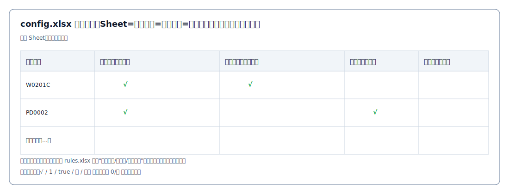

# Config

## 为什么需要配置（config.xlsx）

规则（rules.xlsx）通常是“全量检查清单”，覆盖多个阶段与多个类型的交付物。但在真实项目中：

- 不同项目的交付范围不同（有的项目没有某些阶段/交付物）
- 同一套规则在不同项目上可能只需要执行其中一部分
- 某些检查项在项目当前阶段尚未适用，提前检查会产生大量误报

因此引入配置 Excel（config.xlsx），用于建立“项目 ↔ 规则检查项”的启用关系，从而：

- 按项目启用/跳过检查：减少噪音与误报
- 按阶段启用检查：让扫描结果更贴合项目进度
- 保持规则复用：一套规则可覆盖多类项目，但执行可按项目裁剪

## 配置如何生效

当导入 config.xlsx 后，系统会对每个项目计算“允许执行的检查项集合”，扫描时仅对允许项执行检查；其余规则会被跳过。

配置 Excel 的建议格式见 docs/getting-started.md 中“配置 Excel（config.xlsx）”小节。

## 模板格式（推荐）

建议结构：

- Sheet 名：阶段名（例如：业务需求阶段 / 设计开发阶段 / 测试阶段 / 投产阶段 / 运维阶段）
- 第一行（表头）：
  - 第 1 列：系统编号/项目编号（必须与导入目录中的项目标识一致）
  - 其余列：检查项名称（建议直接从 rules.xlsx 复制粘贴，避免不一致）
- 数据行：每行一个项目
  - 对应检查项单元格填：√ / 1 / true / 是 / 需要 等表示启用
  - 为空或 0/否 表示不启用

匹配口径：

- 检查项列名会与规则的以下字段做字符串匹配（去掉首尾空格）：检查要点（checkpoint/pattern）/ 检查项列标题（item）/ 规则名称（name）。
- 某项目在某阶段“未配置任何检查项”时，会回退为“该阶段不执行规则”；若整个项目未配置任何阶段，则回退为“使用全部规则”。
