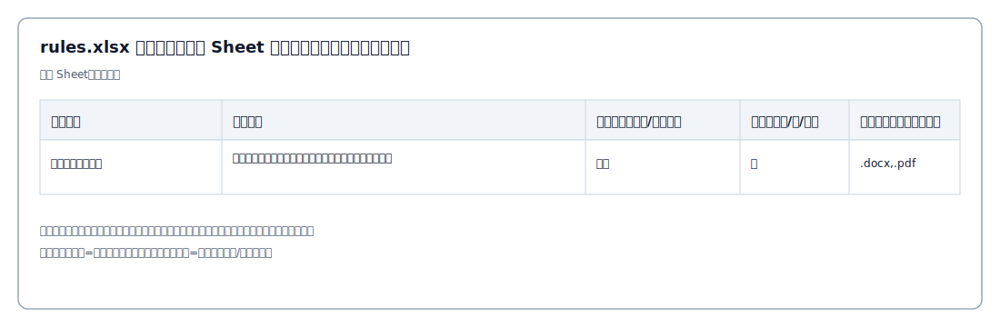

# Rules（rules.xlsx）

规则 Excel（rules.xlsx）用于定义“要检查什么”。系统会按 Sheet 解析规则，并在扫描时针对每条规则匹配候选文件并执行检查。

## 模板格式

建议按阶段拆分 Sheet（Sheet 名即阶段名，例如：业务需求阶段 / 设计开发阶段 / 测试阶段 / 投产阶段 / 运维阶段），每行一条规则。

最简字段（推荐使用本项目提供的下载模板生成）：

| 列名 | 说明 | 必填 | 示例 |
| --- | --- | --- | --- |
| 规则名称 | 规则的展示名称 | 否（为空时会回退使用“检查要点”） | 测试报告是否齐全 |
| 检查要点 | 规则详细描述（用于内容检查/提示词生成） | 是 | 提供《测试报告》并包含主要结论与回归结果 |
| 检查对象（内容/文件名） | content=内容检查；file=只检查文件是否存在/命名 | 否（默认内容） | 内容 / 文件名 |
| 严重性（高/中/低） | high/medium/low 或 高/中/低 | 否（默认中） | 高 |
| 后缀（可空，逗号分隔） | 限制可匹配文件类型；为空表示不限 | 否 | .docx,.pdf,.xlsx |

## 解析与生效规则

- 阶段：优先使用 Sheet 名作为阶段；用于扫描结果的“阶段”展示与过滤。
- 检查对象：
  - 内容：会提取候选文件正文并进行内容检查（会调用大模型）。
  - 文件名：主要用于“是否提供/是否存在/命名规范”等场景，系统会以文件存在/命名为主，不要求正文证据。
- 严重性：支持 high/medium/low 以及中文 高/中/低（无法识别时按“中”处理）。
- 后缀：多个后缀用逗号分隔；支持 `.docx` 形式或 `docx` 形式（会自动补点）。

## 与 config.xlsx 的联动

config.xlsx 的“检查项列名”需要能匹配规则中的以下任意一个字段（按字符串精确匹配，去除首尾空格）：

- 检查要点（检查项/规则详细）
- 规则名称
- 解析时识别到的“检查项列标题”（若你的 rules.xlsx 使用了多列表达不同检查项）

